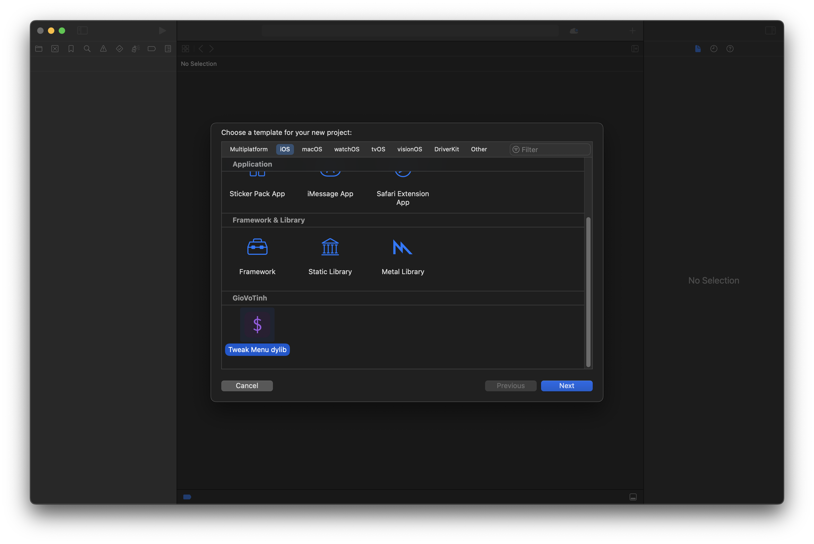
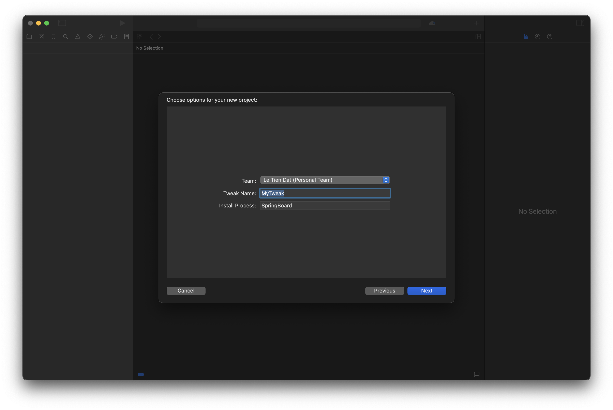

# Template-Mod-Menu-Theos-XCode




---

## Cài đặt

**Bước 1**

- Tải dự án về máy

---

**Step 2**

Chạy file `setup.sh` để cài đặt template

```
cd Template-Mod-Menu-Theos-XCode
chmod +x setup.sh
./setup.sh
```

---

**Bước 3**

- Tắt XCode và mở lại

- Chọn `File > New > Project` or bấm `Command + Shift + N` để mở màn hình tạo dự án

- Template tweak sẽ nằm ở mục iOS và có thể chọn

---

**Bước 4**

- Nhập `Tweak Name` và `Install Process`
- Chọn `Create`

---

**Bước 5**

- Bấm `Run (Cmd + R)` hoặc `Build (Cmd + B)` để build dylib

*File .dylib sẽ nằm trong thư mục `.theos/obj`.*

---

## Setup

**Step 1**

- Clone repo

---

**Step 2**

Run script `setup.sh` to install template

```
cd Template-Mod-Menu-Theos-XCode
chmod +x setup.sh
./setup.sh
```

---

**Step 3**

- Kill and Reopen XCode

- Choose `File > New > Project` or press `Command + Shift + N` open screen to create project

- Template tweaks will be located in the iOS section and can be selected

---

**Step 4**

- Enter `Tweak Name` and `Install Process`
- Press `Create`

---

**Step 5**

- Click `Run (Cmd + R)` or `Build (Cmd + B)` to build dylib

*The .dylib file will be located in the `.theos/obj` directory.*
